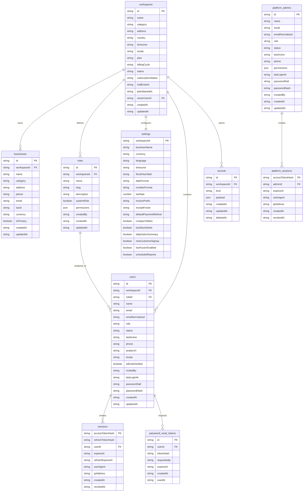

# RhinoPeak Business Dashboard - MongoDB Data Model

This document describes the current MongoDB collections used by the Django API. Tenant data is scoped by `workspaceId`; the SaaS platform portal uses separate platform admin collections.

Record payload kinds are `sales`, `customers`, `inventory`, `inventory_movements`, `reports`, `audit_logs`, `billing_history`, `feature_flags`, and `support_tickets`.

Important payload attributes now audited by `GET /api/schema/audit`:

- Sales: invoice number, business, customer, subtotal, discount, tax, amount, currency, payment, status, notes, audit trail, timestamps, and complete line item totals.
- Customers: company, source, tax ID, credit limit, balance, language preference, segment, purchase totals, and timestamps.
- Inventory: description, SKU, barcode, brand, category, unit, stock, reorder level, pricing, tax rate, supplier, location, status, active flag, and timestamps.
- Billing: plan, billing cycle, currency, invoice number, gateway, paid date, amount, and status.
- Platform: platform owners, super admins, support admins, platform sessions, tenant subscription status, health metrics, and organization controls.

Run `GET /api/schema/audit` to verify required collections and required payload fields in the active MongoDB database.
